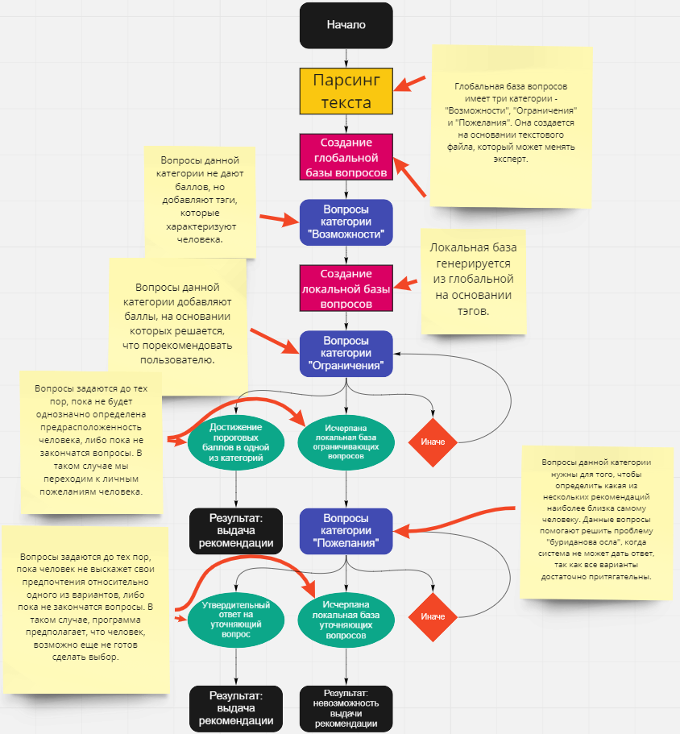

# Отчет по лабораторной работе
## по курсу "Искусственый интеллект"

### Студенты: 

| ФИО            | Роль в проекте                                                                 | Оценка       |
|----------------|--------------------------------------------------------------------------------|--------------|
| Гребенков Д. И.| Написание программы обработки списка вопросов (ESTextParser), написание отчёта |              |
| Калугин К. А.  | Реализация интерфейса приложения (widget), тестирование готовой программы      |              |
| Якушкина М. К. | Реализация алгоритма подбора вопросов (program), разметка списка вопросов      |              |

Разработка представления предметной области и алгоритма подбора вопросов, написание самих вопросов и общая отладка программы проводились совместно.

## Результат проверки

| Преподаватель     | Дата         |  Оценка       |
|-------------------|--------------|---------------|
| Сошников Д.В.     |              |    4.6           |

> *Вы молодцы, что написали много кода на С++ и придумали свой механизм вывода. Плохо, что в итоге не использовалась идея вывода на основе поиска, поэтому по сути механизм реализует выбор на основе взвешенной суммы, что не всегда позволяет охватить разные особенности знаний экспертов. Синтаксис описания базы знаний получился не слишком наглядным.*

## Тема работы

Опишите тему работы, включая выбранную предметную область для реализации экспертной системы.

Экспертная система для профориентации.

На основании получаемых ответов на вопросы выдаёт совет о том, куда человеку стоит идти после окончания школы - на работу, в колледж или в ВУЗ.

## Концептуализация предметной области

Опишите результаты концептуализации предметной области:
 - выделенные понятия
 - связи между ними, тип получившейся онтологии (словарь, сеть, иерархия и т.д.)
 - опишите возможные статические и динамические знания
 - как предметная область может быть разделена между участниками для коллективного создания базы знаний

**Выделенные понятия:** рекомендация (итог работы эксперта или ЭС), личные данные (категория вопросов "возможности" - анкетные данные), личные предрасположенности (категория вопросов "ограничения"), личные предпочтения (категория вопросов "пожелания").

**Связи между понятиями:** на основании личных данных формируются вопросы о предрасположенностях, на основании выявленных предрасположенностей задаются вопросы о предпочтениях, по собранным данным о предрасположенностях и пожеланиях формируется рекомендация. 

**Статические и динамические знания:**

Статические - список вопросов о личных данных, так как *все* эти вопросы задаются *без изменений*. Динамические - вопросы о предпочтениях и пожеланиях, так как они *формируются в процессе* работы системы на основании предыдущих ответов.

**Возможность разделения предметной области:** 

Предметную область можно условно разделить на несколько "веток" вопросов, каждую из которых эксперты могут прорабатывать независимо друг от друга.

## Принцип реализации системы

Опишите:
 - Какой механизм вывода вы предполагаете использовать и почему
 - Какую систему программирования вы предполагаете использовать и почему
 - Если это имеет смысл, приведите графическую иллюстрацию архитектуры системы. Если система состоит из разных частей (бот, механизм вывода) - опишите принципы интеграции

**Механизм вывода:**

Система баллов. При ответе на вопросы вариантам итогов работы системы добавляется некоторое количество баллов. После окончания опроса на основании этих баллов и выводится рекомендация.

**Система программирования:** 

Использовался Qt Creator (Qt 5) на базе C++. Эта система была выбрана, так как она предоставляет возможность использовать знакомый всем участникам работы язык программирования C++, а также некоторые средства отображения и взаимодействия с пользователем.



## Механизм вывода

Опишите, как работает механизм вывода. Наиболее интересные фрагменты кода приведите в отчете.

На основании ответов присуждаются баллы одной (или нескольким) из трёх категорий - институт, колледж или работа. После получения ответов определяется рекомендация - решение о том, куда направить проходившего опрос.

## Извлечение знаний и база знаний

Опишите, как происходило извлечение знаний, с учётом совместной работы над проектом. Приведите фрагменты представления знаний: дерево И-ИЛИ, наиболее интересные правила.

Извлечение знаний происходило путём обсуждения текстов вопросов и вариантов ответов, присуждаемых за ответы баллов и присваиваемых тегов. Затем проводилась запись вопросов в текстовый файл по особой структуре.

Пример вопроса:

```
question
Подлежите ли вы призыву?
tags: male
answer
Да.
tags: army
answer
Нет.

question
Как вы относитесь к службе в армии?
tags: army
answer
Хорошо, хочу служить.
work 20
tags: contract
answer
Плохо, не хочу служить.
college 10
university 10
tags: avoid
answer
Нейтрально.
```

## Протокол работы системы

Приведите несколько примеров работы системы, проиллюстрируйте их фрагментами деревьев вывода.

Пример работы системы - вопросы и выбранные варианты ответов.
```
Ваш пол?
Мужской.
Готовы ли вы на длительное время покинуть родной город?
Готов.
Насколько материально обеспечена ваша семья?
Средне обеспечена.
Насколько вы физически развиты?
Я нахожусь в хорошей форме.
Насколько для вас важны пожелания ваших близких (родственников, друзей и тд)?
Очень важны!
Как вы оцениваете свои общие знания?
Я мало знаю.
Куда, по мнению ваших близких, вам следует поступать?
Идти работать.
Умеете ли вы готовить?
Умею.
Нужна ли вам дальнейшая учеба?
Нет.
Насколько легко вы подчиняетесь приказам начальства?
Мне легко выполнять чужие команды.
Насколько скоро вы планируете начать работать?
Как можно быстрее.
Умеете ли вы уживаться с людьми?
Умею.

Результат - "Мы рекомендуем вам не получать образование".
```

## Выводы

Сформулируйте *содержательные* выводы по лабораторной работе. Чему он вас научила? 
Над чем заставила задуматься? В чём состояли основные сложности в работе? Насколько эффективной получилась командная работа, и какие методы для повышения эффективности командной работы вы использовали (scrum, slack, ...)?

Мы узнали о том, что такое экспертные системы и на примере научились их создавать. - Якушкина М. К.

Думаю, основные сложности, с которыми мы столкнулись в работе - грамотно составить вопросы и баллы, выдаваемые за ответы; организовать работу группы так, чтобы каждому досталась посильная работа в достаточном объёме; распределить между участниками задачи по написанию программ так, чтобы эти программы можно было отлаживать независимо друг от друга. - Гребенков Д. И.

Данная лабораторная работа научила меня нескольким вещам. Во-первых, я получил опыт работы в команде, который определенно пригодится мне в будущем и которого у меня не было. Во-вторых, я понял что статус лидера команды требует соответствия ему - нужно организовывать работу команды, иначе результат будет плачевен. В-третьих, я познакомился с экспертными системами и принципами их работы. В-четвертых, я получил опыт работы с гитхабом. Подытоживая, могу сказать, что выполнение этой лабораторной было интересным, полезным и запоминающимся. - Калугин К. А.
